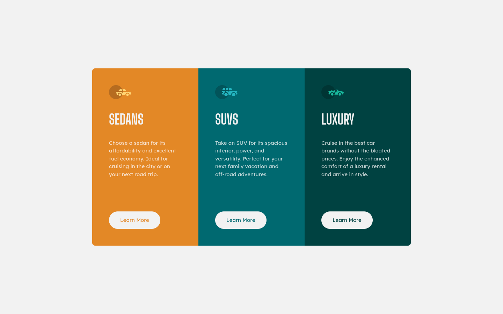

# Frontend Mentor - 3-column preview card component solution

This is a solution to the [3-column preview card component challenge on Frontend Mentor](https://www.frontendmentor.io/challenges/3column-preview-card-component-pH92eAR2-).

## Table of contents

-   [Overview](#overview)
    -   [Links](#links)
    -   [The challenge](#the-challenge)
    -   [Screenshot](#screenshot)
        -   [Desktop view](#desktop-view)
        -   [Mobile view](#mobile-view)
-   [My process](#my-process)
    -   [Built with](#built-with)
-   [Author](#author)

## Overview

### Links

-   Live Site URL: [Github pages](https://pietyr.github.io/3-column-preview-card-component/)

### The challenge

Users should be able to:

-   View the optimal layout depending on their device's screen size
-   See hover states for interactive elements

### Screenshot

#### Desktop view

#### Mobile view

## My process

### Built with

-   Semantic HTML5 markup
-   CSS custom properties
-   Flexbox
-   Mobile-first workflow

## Author

-   Piotr Kisiel
-   Github - [pietyr](https://github.com/pietyr)
-   Frontend Mentor - [@pietyr](https://www.frontendmentor.io/profile/pietyr)
